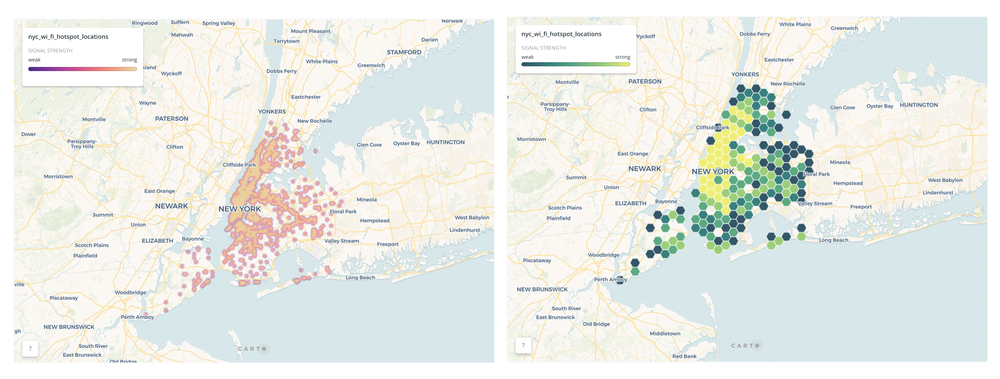
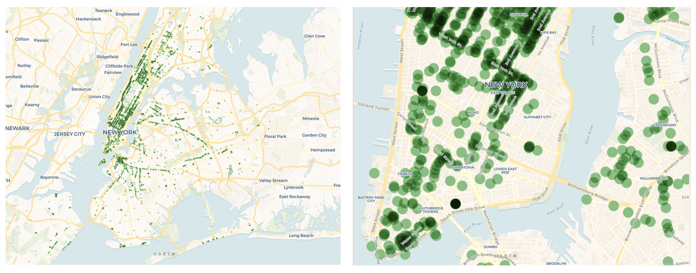
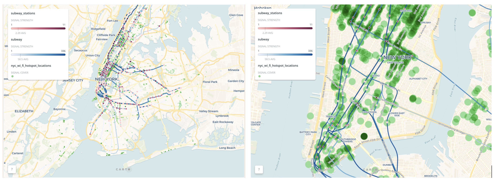
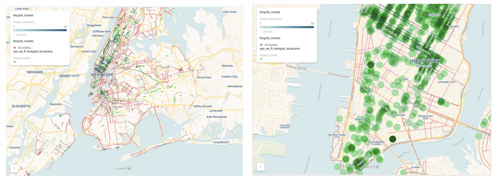

## 1.Introduction
Wi-Fi networks are now more and more popular among urban residents. Some public places or private places have provided Wi-Fi networks to the public free of charge. Public Wi-Fi brings convenience to people's lives and transportation. On the other hand, people's behavior data recorded by Wi-Fi is an important data source. It can provide data for better urban planning. Of course, there is also a certain commercial value. The construction of public Wi-Fi in the city is an important step in building a smart city. Reasonable site selection can improve the efficiency of resource utilization. 

## 2.Theme Review
The subway is a good way to travel on weekdays, it won't be affected by traffic jams compared to other modes of transportation.In the spare time, cycling is a great way to relax and exercise.This notebook analyzes the current Wi-Fi station and traffic data(Subway and Bicycle) in New York City, finds potential deficiencies, and proposes corresponding strategies.

## 3.Data and Methods
Data: 1) NYC Free Public Wi-Fi 2) NYC Subway Routes 3) NYC Subway Stations 4) NYC Bicycle Routes 5) NYC Bicycle Parking Shelters

### a.Statistics Analysis and Data Visualization

```{r}
# set working path
getwd()
setwd('/Users/afen/Documents/GitHub/WIFI_hotspot_analysis_based_NYC')
```

```{r}
# load data
# data resource: https://data.cityofnewyork.us/Social-Services/NYC-Wi-Fi-Hotspot-Locations/
wifi_data <- read.csv('./data/NYC_Free_Public_WiFi_03292017.csv')
head(wifi_data)
names(wifi_data)
```

```{r}
# subset the data select interesting columns
wifi_data <- subset(wifi_data,select = c("the_geom","TYPE","PROVIDER","LAT","LOCATION","LON","X","Y","BORONAME"))
# summary data
head(wifi_data)
summary(wifi_data)
```

```{r}
# Data visualization
library(ggplot2)
```

```{r}
library(scales)
# plot bar graph to show data distribution
wifi_pro <- ggplot(wifi_data,aes(PROVIDER))
wifi_pro + geom_bar(aes(fill=TYPE)) + scale_fill_brewer(direction = -1,palette = "Green") + theme(axis.text.x = element_text(colour="grey20",size = 5,angle=45,hjust=.5,vjust=.5,face="plain"))
```

```{r}
wifi_boro <- ggplot(wifi_data,aes(BORONAME))
wifi_boro + geom_bar(aes(fill=TYPE)) + scale_fill_brewer(palette = "Green",direction = -1)
```
Choropleth and Heat map powered by carto[https://carto.com/]


### b.Spatial Queries and Spatial Analysis
```{r}
# use cartodb to do analysis from spatial database
library(RCurl)
library(bitops)
library(RJSONIO)
library(devtools)
library(CartoDB)
```

```{r}
# connect to our account
cartodb("zhoumaneo")
cartodb.test()
```

```{r}
cartodb("zhoumaneo", api.key="fb070799acad21d626b5ade94caa3542b7decd88")
```

#### 1) Do some spatial queries and plot the results

```{r}
library(rgdal)
# Spatila Queries based on requirments
bicycle_routes <- cartodb.collection(sql="SELECT * FROM bicycle_routes",method="GeoJSON")
bicycle_routes.SP <- readOGR(bicycle_routes,layer = 'OGRGeoJSON',verbose =FALSE)
Free_wifi_hotspot <- cartodb.collection(sql = "SELECT * FROM nyc_wi_fi_hotspot_locations WHERE type = 'Free'",method = "GeoJSON")
Free_wifi_hotspot.SP <- readOGR(Free_wifi_hotspot,layer = 'OGRGeoJSON',verbose = FALSE)
bicycle_parking_shelters <- cartodb.collection(sql="SELECT * FROM bicycle_parking_shelters",method = "GeoJSON")
bicycle_parking_shelters.SP <- readOGR(bicycle_parking_shelters,layer = 'OGRGeoJSON',verbose = FALSE)
```

This plot is to show the location relationship between free wifi hotspot and bicycle routes

```{r}
# plot the results of queries
plot(bicycle_routes.SP)
plot(Free_wifi_hotspot.SP,col = "red",add = TRUE)
plot(bicycle_parking_shelters.SP,col = "green",add = TRUE, pch = 20)
```

```{r}
Limited_free_wifi_hotspot <- cartodb.collection(sql = "SELECT * FROM nyc_wi_fi_hotspot_locations WHERE type = 'Limited Free'",method = "GeoJSON")
Limited_free_wifi_hotspot.SP <- readOGR(Limited_free_wifi_hotspot,layer = 'OGRGeoJSON',verbose = FALSE)
```

This plot is to show the location relationship between limited free wifi hotspot and bicycle routes

```{r}
plot(bicycle_routes.SP)
plot(Limited_free_wifi_hotspot.SP,col = "red",add = TRUE)
plot(bicycle_parking_shelters.SP, col = "green",add = TRUE, pch = 20)
```

```{r}
subway_routes <- cartodb.collection(sql = "SELECT * FROM subway",method = "GeoJSON")
subway_routes.SP <- readOGR(subway_routes,layer = 'OGRGeoJSON',verbose = FALSE)
subway_stations <- cartodb.collection(sql = "SELECT * FROM subway_stations",method = "GeoJSON")
subway_stations.SP <- readOGR(subway_stations,layer = 'OGRGeoJSON',verbose = FALSE)
```

This plot is to show the location relationship between wifi hotspot and subway routes

```{r}
# to show spatial relationship about subway routes and wifi hotspots
plot(subway_routes.SP)
plot(subway_stations.SP,add = TRUE)
plot(Free_wifi_hotspot.SP,col = "green",add = TRUE)
plot(Limited_free_wifi_hotspot.SP,col = "dark green",add = TRUE)
```
#### 2) Spatial analysis
The wifi signal is spread out by the wifi station. The signal strength decreases with distance. Generally, the Wi-Fi signal has a radiation distance of less than 100m. 
This notebook uses 100m as range to do buffer as the zones of signal covered. And then do some spatial intersect analysis to see the signal coverage of various subway lines and bicycle routes. Finally, I also use buffer and intersection to see the utilizations of wifi hotspot.
```{r}
# Buffer analysis
# Buffer wifi hotspot data to 100m range
wifi_buffers <- cartodb.collection(sql="SELECT cartodb_id,  ST_Buffer(the_geom::geography,100) as the_geom FROM nyc_wi_fi_hotspot_locations",method="GeoJSON")

wifi_buffers.SP <- readOGR(wifi_buffers,layer = 'OGRGeoJSON',verbose =FALSE)

plot(wifi_buffers.SP[1:100,])
```

* Wifi hotspot locations buffer by carto


* The signal coverage of various subway lines.


* The signal coverage of various bicycle routes.


#### 3) Utilization of wifi hotspot

```{r}
# buffer the subway routes
subway_routes_buffers <- cartodb.collection(sql="SELECT cartodb_id,  ST_Buffer(the_geom::geography,100) as the_geom FROM subway",method="GeoJSON")

subway_routes_buffers.SP <- readOGR(subway_routes_buffers,layer = 'OGRGeoJSON',verbose =FALSE)

plot(subway_routes_buffers.SP)
```
Find the wifi hotspots that do not intersect with the buffer of subway routes
```{r}
# intersection 
wifi_hotspot_without_subway_routes <- cartodb.collection(sql = "SELECT a.* FROM nyc_wi_fi_hotspot_locations AS a,subway AS b WHERE NOT ST_Intersects(a.the_geom,ST_Buffer(b.the_geom::geography,100))",method = "GeoJSON")
# Plot the results
wifi_hotspot_without_subway_routes.SP <- readOGR(wifi_hotspot_without_subway_routes,layer = 'OGRGeoJSON',verbose =FALSE)
```


```{r}
plot(wifi_hotspot_without_subway_routes.SP,col = "red")
plot(subway_routes.SP,add=TRUE)
```
Red points show some wifi hotspots don't locate within 100m from the subway routes.

```{r}
wifi_hotspot_without_bicycle_routes <- cartodb.collection(sql = "SELECT a.* FROM nyc_wi_fi_hotspot_locations AS a,bicycle_routes AS b WHERE NOT ST_Intersects(a.the_geom,ST_Buffer(b.the_geom::geography,100))",method = "GeoJSON")

wifi_hotspot_without_bicycle_routes.SP <- readOGR(wifi_hotspot_without_bicycle_routes,layer = 'OGRGeoJSON',verbose =FALSE)
```

```{r}
plot(wifi_hotspot_without_bicycle_routes.SP,col = "red")
plot(bicycle_routes.SP,add=TRUE)
```
Red points show some wifi hotspots don't locate within 100m from the bicycle routes.

```{r}
wifi_hotspot_without_subway_bicycle_routes <- cartodb.collection(sql = "SELECT a.* FROM nyc_wi_fi_hotspot_locations AS a,bicycle_routes AS b,subway AS c WHERE NOT ST_Intersects(a.the_geom,ST_Buffer(b.the_geom::geography,100)) AND NOT ST_Intersects(a.the_geom,ST_Buffer(c.the_geom::geography,100))",method = "GeoJSON")

wifi_hotspot_without_subway_bicycle_routes.SP <- readOGR(wifi_hotspot_without_subway_bicycle_routes,layer = 'OGRGeoJSON',verbose =FALSE)
```

```{r}
plot(wifi_hotspot_without_subway_bicycle_routes.SP,col = "red")
```
Only one point is neither in the buffer of the subway line nor in the buffer of the bicycle routes

```{r}
wifi_hotspot_without_subway_routes_table <- cartodb.collection(sql = "SELECT a.* FROM nyc_wi_fi_hotspot_locations AS a,subway AS b WHERE NOT ST_Intersects(a.the_geom,ST_Buffer(b.the_geom::geography,100))")
```

## 4.Results and Conclusion

* Results

 a. The number of free wifi hotspots is different in different boroughs in New York City. There is the largest number of wifi hotspots in Manhattan.
 
 b. From the signal coverage maps above, most subway lines are covered by strong wireless network signals. On the other hand, most bicycle routes don't covered by wifi signals. When there are some emergencies along these routes, people may not get Wi-Fi support.
 
 c.Most Wi-Fi stations are highly utilized.They provide wifi for passengers on the subway or cyclists.
 
* Strategies

 a. Build wifi database to record the behavior data of people from wifi stations.These data can in turn help Wi-Fi station site selection. Except this, this dataset can help analyze other urban issues.
 
 b. It can be a good way that recruiting merchant financing by sharing wifi data to improve the construction of basic wifi hotspot.
 
 c. Promote healthy lifestyles to organize cycling activities to attract investment and improve infrastructure.

## 5.	References

 * Seufert, Griepentrog, Burger, & Hobfeld. (2016). A Simple WiFi Hotspot Model for Cities. Communications Letters, IEEE, 20(2), 384-387.
 
 * Gowex. (2013). Gowex to merge public, private WiFi to create smart city hotspot networks. Total Telecom Magazine, Total Telecom Magazine, Nov 5, 2013.
 
 * Data Visualization with ggplot2 Cheat Sheet [https://www.rstudio.com/wp-content/uploads/2015/03/ggplot2-cheatsheet.pdf]
 
 * CartoDB[https://github.com/CartoDB/cartodb]
 
 
### Author information
 * Author: zhoumaneo
 * Resource: [https://github.com/zhoumaneo/WIFI_hotspot_analysis_based_NYC]
 
